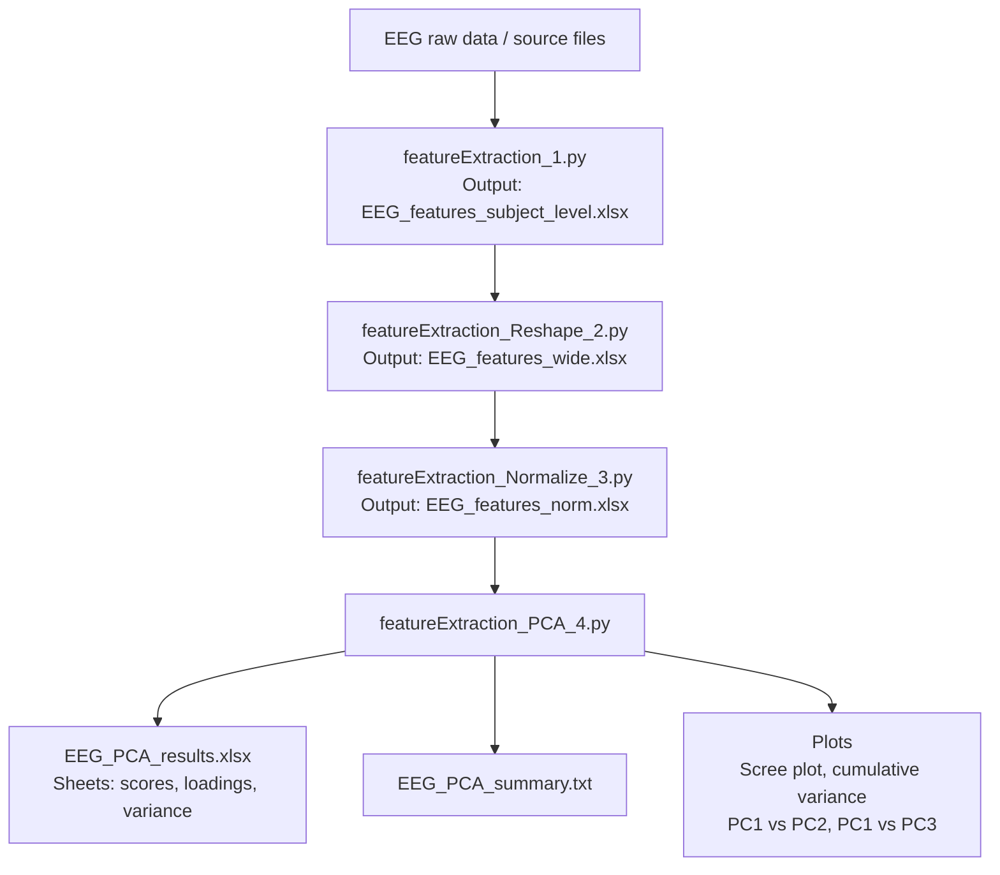

# EEGfeatureExtraction
Pipeline for extracting features from EEG signals and performing subsequent analysis. The scripts are designed for signals acquired with a 128-channel BioSemi system. After feature extraction, the resulting data are reshaped, normalized, and their dimensionality is reduced using PCA.

---

## General pipeline
Describí en 3-6 líneas cuál es la lógica general del flujo de trabajo.

### 1. `featureExtraction_1.py`

**Purpose**  
This script receives a set of signals from multiple recordings, listed in the `file_all` list in the main block. All files are assumed to be located in the same folder, whose path is specified in `path`. Features are extracted for the conditions listed in `conds` and for the frequency bands defined in the `BANDS` dictionary, which contains both the band names and their corresponding frequency ranges. Bad channels for each recording are specified in the `bads_all` array.

The extracted features are periodic band power, aperiodic exponent and offset (modeled using the FOOOF algorithm), weighted phase lag index (wPLI), weighted symbolic mutual information (wSMI), Lempel-Ziv complexity (LZC), transfer entropy (TE), and permutation entropy (PE).

**Inputs**
- **Recordings**, listed in `file_all` and located in `path`
- **Bad Channels**, listed in `bads_all`
- `BANDS` in wich we compute the features
- `conds`, conditions to analyze in Status channel.

**Output**
- **EEG_features_subject_level.xlsx**, a file with each feature for each subject, band and condition.

**Notes**  
Aperiodic components are exported for each band, but they are the same across all bands. The same occurs with LZC and TE data. Later in the pipeline they are unified. The `preprocessing_mne` has a parameter named `edit_marks` in which we can add artificial marks on the status channel to create smaller epochs.


### 2. `featureExtraction_Reshape_2.py`

**Purpose**  
This script simply reshapes the output generated by the previous script. The band factor is converted to wide format by adding separate columns for each feature in each band. The only exceptions are the aperiodic offset and exponent, LZ and TE, since they are identical across all bands within a given subject and condition. Therefore, they are consolidated into a single column. The resulting data are exported to a file named `EEG_features_wide.xlsx`.

**Input**
- **EEG_features_subject_level.xlsx**

**Output**
- **EEG_features_wide.xlsx**, the data reshaped.

### 3. `featureExtraction_Normalize_3.py`

**Purpose**  
This script normalizes and standardizes the dataset generated in the previous step. The objective is to prepare the data for principal component analysis. Standardization is performed using `StandardScaler()` so that each variable has a mean of zero and a variance of one. This is necessary because, otherwise, variables with greater dispersion would dominate the analysis.

**Input**
- **EEG_features_wide.xlsx**

**Output**
- **EEG_features_norm.xlsx**, the same data but standardized.

**Notes**  
The only columns that are not standardized are `subject` and `condition` because they are supposed to be categorical variables.

### 4. `featureExtraction_PCA_4.py`

**Purpose**  
The script takes as input a file generated in the previous step. It performs principal component analysis (PCA) on all included features, excluding `subject` and `condition`. Internally, it computes the coordinates of each observation on each principal component, the loading of each original variable on each component, and, for each component, the explained variance and cumulative explained variance. It also calculates how many components are required to reach the defined criterion of 80% cumulative explained variance.

In addition to the exported outputs, the script also generates visual outputs displayed on screen, although they are not currently saved as files. It shows a scree plot with the explained variance of each component, a cumulative explained variance plot with the 80% threshold marked, a scatter plot of PC1 versus PC2 colored by `condition`, and a scatter plot of PC1 versus PC3 also colored by `condition`. These plots are intended for visual inspection.

**Input**
- **EEG_features_wide.xlsx**

**Output**
- **EEG_features_norm.xlsx**, the same data but standardized.
- **EEG_PCA_results.xlsx**: contains three sheets.
  - The `scores` sheet includes one row per observation and stores `subject`, `condition`, and the coordinates of that observation on all principal components, that is, PC1, PC2, PC3, and so on.
  - The `loadings` sheet includes one row per original variable and one column per principal component; it stores the contribution of each variable to each component.
  - The `variance` sheet includes one row per component and stores the component name, the absolute explained variance, the proportion of explained variance, and the cumulative explained variance.

- **EEG_PCA_summary.txt**: summarizes the execution of the analysis. It includes the name of the input file, the number of observations, the total number of original variables, the number of variables actually included in the PCA, the excluded columns, the 80% cumulative explained variance selection criterion, and the number of components required to reach it. In addition, it lists, component by component, the explained variance and the cumulative explained variance.

**Notes**  
Plots are shown, but they are not exported in the current version of the script.

---

## Repository structure

```text
EEGfeatureExtraction/
├── featureExtraction_1.py
├── featureExtraction_Reshape_2.py
├── featureExtraction_Normalize_3.py
├── featureExtraction_PCA_4.py
└── README.md
```



# Post-PCA statistical analysis and prediction
R scripts for downstream analyses after PCA on EEG-derived features. The scripts are designed for a dataset where each subject has PCA scores for three experimental conditions (40, 60, 100) and behavioral measures stored in a separate spreadsheet.

## General input files

All scripts assume the working directory contains:

- `EEG_PCA_results.xlsx`
  - uses the sheet `scores`
  - expected columns include:
    - `subject`
    - `condition`
    - `PC1`, `PC2`, `PC3`, etc.

- `Protocolo2023_conducta.xlsx`
  - uses the sheet `Hoja1`
  - expected columns include:
    - `subject`
    - `Grupo`
    - behavioral variables such as `REY` or `AUT`
   
## Common preprocessing choices

Across scripts, the following preprocessing decisions are applied:

- manual exclusion of subjects:
  - `02_test_2023`
  - `15_test_2023`
- `Grupo` is treated as a categorical variable
- `condition` is treated as a categorical variable
- color convention:
  - `Habituación` → `#008080`
  - `Novedad` → `#dc143c`
 
## Recommended execution order

A reasonable order for using these scripts is:

1. `comparacionesPostPCA.R`
2. `correlacionesPostPCA.R`
3. `correlacionesPostPCA_grupo.R`
4. `elasticNetPostPCA.R`
5. `elasticNetPostPCA_OneCond.R`

This order goes from inferential analyses on PCA scores to predictive analyses using PCA scores as predictors.

## 1. `comparacionesPostPCA.R`

### Purpose

Tests whether the first three principal components differ by experimental group and condition.

### Main analysis

For each of `PC1`, `PC2`, and `PC3`, the script fits a linear mixed model of the form:

`PC ~ Grupo * condition + (1 | subject)`

This allows testing:

- main effect of `Grupo`
- main effect of `condition`
- `Grupo × condition` interaction

### Additional features

- detects outliers using the `1.5 × IQR` rule within each condition and each PC
- prints which `subject` corresponds to each outlier
- removes outlier subject-condition rows from the final analysis
- generates distribution plots and mean plots by group and condition
- exports ANOVA tables, fixed effects and post hoc results

### Outputs

- `PC_mixed_models_results_no_outliers.xlsx`
- `PC_mixed_models_summary_no_outliers.txt`
- folder with plots:
  - `PC_plots_no_outliers/`

### When to use it

Use this script when the main question is whether EEG latent dimensions differ between groups and/or conditions.

## 2. `correlacionesPostPCA.R`

### Purpose

Computes correlations between `PC1`, `PC2`, `PC3` and a behavioral variable, using all subjects together within each condition.

### Main analysis

For each condition (`40`, `60`, `100`) and each PC (`PC1`, `PC2`, `PC3`), the script computes a Pearson correlation with the selected behavioral output, typically `REY`.

This yields 9 analyses in total.

### Visualization

For each analysis, the script generates a scatter plot:

- all subjects included
- points colored by `Grupo`
- one global regression line
- annotation with:
  - `r`
  - `p`
  - `n`

### Multiple-comparison correction

- raw `p` values
- Holm-corrected `p` values across the 9 tests

### Outputs

- `PC_REY_correlations.xlsx`
- `PC_REY_correlations_summary.txt`
- folder with plots:
  - `Correlations_PCs_REY/`

### When to use it

Use this script when the goal is to evaluate simple linear associations between PCA scores and behavior within each condition, while still visualizing both groups together.

## 3. `correlacionesPostPCA_grupo.R`

### Purpose

Computes the same PC-behavior correlations as above, but separately for each experimental group.

### Main analysis

For each:

- group (`Habituación`, `Novedad`)
- condition (`40`, `60`, `100`)
- PC (`PC1`, `PC2`, `PC3`)

the script computes a Pearson correlation with the selected behavioral variable.

This yields 18 analyses in total.

### Visualization

For each analysis, the script generates a scatter plot:

- only subjects from one group
- one regression line
- annotation with:
  - `r`
  - `p`
  - `n`

### Multiple-comparison correction

- raw `p` values
- Holm-corrected `p` values across the 18 tests

### Outputs

- `PC_REY_correlations_by_group.xlsx`
- `PC_REY_correlations_by_group_summary.txt`
- folder with plots:
  - `Correlations_PCs_REY_by_group/`

### When to use it

Use this script as an exploratory analysis to see whether the relation between PCA scores and behavior differs across groups.

### Important note

Because the sample is split by group, the number of subjects per analysis becomes small. Results should therefore be interpreted cautiously and mainly as exploratory.

## 4. `elasticNetPostPCA.R`

### Purpose

Uses PCA scores to predict a behavioral output at the subject level with Elastic Net regularization.

### Main idea

This script builds one row per subject by taking `PC1`, `PC2`, and `PC3` separately for each condition:

- `PC1_40`, `PC1_60`, `PC1_100`
- `PC2_40`, `PC2_60`, `PC2_100`
- `PC3_40`, `PC3_60`, `PC3_100`

It then adds `Grupo` as an additional predictor.

### Predictors

- `Grupo`
- `PC1_40`, `PC1_60`, `PC1_100`
- `PC2_40`, `PC2_60`, `PC2_100`
- `PC3_40`, `PC3_60`, `PC3_100`

### Target

Defined in the script with:

`target_var <- "REY"`

This can be changed to any other behavioral variable present in the conduct spreadsheet.

### Model selection

- external validation: leave-one-out cross-validation
- internal tuning:
  - `alpha` grid from ridge to lasso
  - `lambda` selected by `cv.glmnet`

### Metrics

The script reports:

- RMSE
- MAE
- predictive `R²`
- correlation between observed and predicted values

### Visualization

The script generates:

- observed vs predicted
- residuals vs predicted
- CV error by `alpha`
- nonzero coefficients of the final model

### Outputs

- `ElasticNet_REY_results.xlsx`
- `ElasticNet_REY_summary.txt`
- folder with plots:
  - `ElasticNet_plots/`

### When to use it

Use this script when the goal is to predict a behavioral output from EEG latent variables and group membership, using all three conditions jointly.

## 5. `elasticNetPostPCA_OneCond.R`

### Purpose

Runs a simpler Elastic Net model using only one condition plus `Grupo`.

### Main idea

Instead of using all three conditions together, this script filters the PCA scores to a single condition and builds a subject-level model with:

- `Grupo`
- `PC1`
- `PC2`
- `PC3`

for that selected condition only.

### Condition selection

Controlled by:

`selected_condition <- 100`

This can be changed to `40`, `60`, or `100`.

### Target

Defined in the script with:

`target_var <- "REY"`

### Model selection

Same strategy as the multi-condition version:

- external LOOCV
- internal tuning of `alpha` and `lambda`

### Visualization

The script generates:

- observed vs predicted
- residuals vs predicted
- CV error by `alpha`
- nonzero coefficients

### Outputs

Examples depend on the chosen condition, e.g.:

- `ElasticNet_condition_100_REY_results.xlsx`
- `ElasticNet_condition_100_REY_summary.txt`
- folder with plots:
  - `ElasticNet_condition_100_plots/`

### When to use it

Use this script to evaluate whether one specific condition, by itself, is sufficient for predicting the behavioral output.

This is useful for comparing:

- condition 40 only
- condition 60 only
- condition 100 only
- all three conditions together

## Practical interpretation guide

These scripts address different questions and should not be interpreted as redundant.

- `comparacionesPostPCA.R` asks whether PCA scores differ by group and condition.
- `correlacionesPostPCA.R` asks whether PCA scores are linearly associated with behavior within each condition.
- `correlacionesPostPCA_grupo.R` asks whether those associations look different when groups are analyzed separately.
- `elasticNetPostPCA.R` asks whether PCA scores and group jointly predict behavior at the subject level.
- `elasticNetPostPCA_OneCond.R` asks whether a single condition is enough for prediction.

In other words:

- mixed models are mainly inferential
- correlations are mainly descriptive/exploratory
- Elastic Net is mainly predictive

## Dependencies

These scripts rely on the following R packages, depending on the file:

- `readxl`
- `dplyr`
- `tidyr`
- `ggplot2`
- `openxlsx`
- `lme4`
- `lmerTest`
- `emmeans`
- `broom.mixed`
- `glmnet`

## Notes

- Sheet names are hard-coded and should match the spreadsheets exactly.
- Subject IDs are expected to match between PCA results and behavioral data.
- The scripts were written for a repeated-measures design with:
  - one fixed group per subject
  - three conditions per subject
  - one behavioral output per subject
