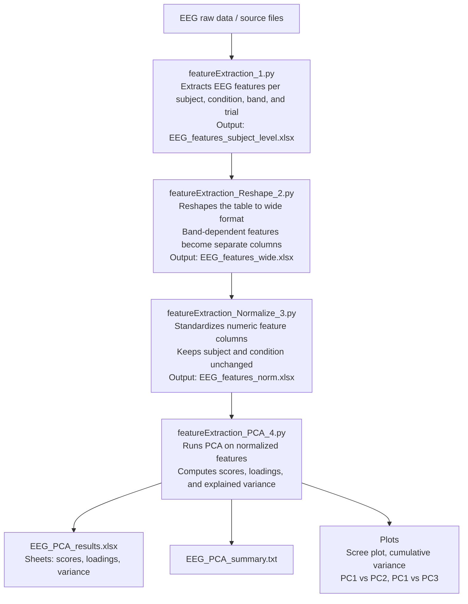

# EEGfeatureExtraction
Pipeline for extracting features from EEG signals and performing subsequent analysis. The scripts are designed for signals acquired with a 128-channel BioSemi system. After feature extraction, the resulting data are reshaped, normalized, and their dimensionality is reduced using PCA.

---

## General pipeline
Describí en 3-6 líneas cuál es la lógica general del flujo de trabajo.

### 1. `featureExtraction_1.py`

**Purpose**  
This script receives a set of signals from multiple recordings, listed in the `file_all` list in the main block. All files are assumed to be located in the same folder, whose path is specified in `path`. Features are extracted for the conditions listed in `conds` and for the frequency bands defined in the `BANDS` dictionary, which contains both the band names and their corresponding frequency ranges. Bad channels for each recording are specified in the `bads_all` array.

The extracted features are periodic band power, aperiodic exponent and offset (modeled using the FOOOF algorithm), weighted phase lag index (wPLI), weighted symbolic mutual information (wSMI), Lempel-Ziv complexity (LZC), transfer entropy (TE), and permutation entropy (PE).

**Inputs**
- **Recordings**, listed in `file_all` and located in `path`
- **Bad Channels**, listed in `bads_all`
- `BANDS` in wich we compute the features
- `conds`, conditions to analyze in Status channel.

**Output**
- **EEG_features_subject_level.xlsx**, a file with each feature for each subject, band and condition.

**Notes**  
Aperiodic components are exported for each band, but they are the same for all of them. Later in the pipeline they are unified. The `preprocessing_mne` has a parameter named `edit_marks` in which we can add artificial marks on the status channel to create smaller epochs.


### 2. `featureExtraction_Reshape_2.py`

**Purpose**  
This script simply reshapes the output generated by the previous script. The band factor is converted to wide format by adding separate columns for each feature in each band. The only exception is the aperiodic offset and exponent, since they are identical across all bands within a given subject and condition. Therefore, they are consolidated into a single column. The resulting data are exported to a file named `EEG_features_wide.xlsx`.

**Input**
- **EEG_features_subject_level.xlsx**

**Output**
- **EEG_features_wide.xlsx**, the data reshaped.

### 3. `featureExtraction_Normalize_3.py`

**Purpose**  
This script normalizes and standardizes the dataset generated in the previous step. The objective is to prepare the data for principal component analysis. Standardization is performed using `StandardScaler()` so that each variable has a mean of zero and a variance of one. This is necessary because, otherwise, variables with greater dispersion would dominate the analysis.

**Input**
- **EEG_features_wide.xlsx**

**Output**
- **EEG_features_norm.xlsx**, the same data but standardized.

**Notes**  
The only columns that are not standardized are `subject` and `condition` because they are supposed to be categorical variables.

### 4. `featureExtraction_PCA_4.py`

**Purpose**  
The script takes as input a file generated in the previous step. It performs principal component analysis (PCA) on all included features, excluding `subject` and `condition`. Internally, it computes the coordinates of each observation on each principal component, the loading of each original variable on each component, and, for each component, the explained variance and cumulative explained variance. It also calculates how many components are required to reach the defined criterion of 80% cumulative explained variance.

In addition to the exported outputs, the script also generates visual outputs displayed on screen, although they are not currently saved as files. It shows a scree plot with the explained variance of each component, a cumulative explained variance plot with the 80% threshold marked, a scatter plot of PC1 versus PC2 colored by `condition`, and a scatter plot of PC1 versus PC3 also colored by `condition`. These plots are intended for visual inspection.

**Input**
- **EEG_features_wide.xlsx**

**Output**
- **EEG_features_norm.xlsx**, the same data but standardized.
- **EEG_PCA_results.xlsx**: contains three sheets.
  - The `scores` sheet includes one row per observation and stores `subject`, `condition`, and the coordinates of that observation on all principal components, that is, PC1, PC2, PC3, and so on.
  - The `loadings` sheet includes one row per original variable and one column per principal component; it stores the contribution of each variable to each component.
  - The `variance` sheet includes one row per component and stores the component name, the absolute explained variance, the proportion of explained variance, and the cumulative explained variance.

- **EEG_PCA_summary.txt**: summarizes the execution of the analysis. It includes the name of the input file, the number of observations, the total number of original variables, the number of variables actually included in the PCA, the excluded columns, the 80% cumulative explained variance selection criterion, and the number of components required to reach it. In addition, it lists, component by component, the explained variance and the cumulative explained variance.

**Notes**  
Plots are shown, but they are not exported in the current version of the script.

---

## Repository structure

```text
EEGfeatureExtraction/
├── featureExtraction_1.py
├── featureExtraction_Reshape_2.py
├── featureExtraction_Normalize_3.py
├── featureExtraction_PCA_4.py
└── README.md
```


